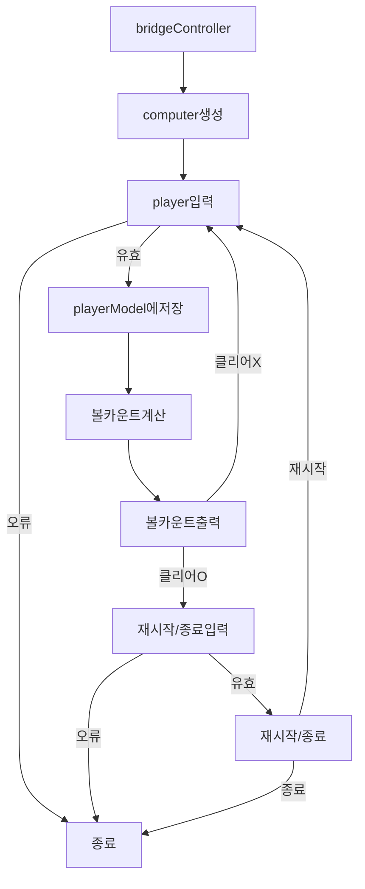

# 디렉토리 구조

```
📦src
 ┣ 📂Constants
 ┃ ┗ 📜Message.js
 ┣ 📂Controller
 ┃ ┗ 📜BaseballController.js
 ┣ 📂Model
 ┃ ┣ 📜Computer.js
 ┃ ┗ 📜Player.js
 ┣ 📂Util
 ┃ ┣ 📜checkGameOption.js
 ┃ ┣ 📜getBallCounts.js
 ┃ ┗ 📜Validation.js
 ┣ 📂View
 ┃ ┣ 📜InputView.js
 ┃ ┗ 📜OutputView.js
 ┗ 📜App.js
```

# 기능 목록

1.  컴퓨터의 번호를 생성하는 기능

- `Model/Computer.js`를 통해 값을 보관하도록 구현

2.  `readLine`을 통하여 숫자를 입력받는 기능

- `View/InputView` 파일을 생성하여 Console 입력받도록 구현
- 입력받은 값은 `Model/Player.js`를 통해 값을 보관하도록 구현

3.  `readLine`을 통하여 입력받은 숫자와 컴퓨터의 번호를 비교하는 기능

- `Util/getBallCounts.js`를 통하여 볼카운트를 계산하도록 구현

4.  비교한 결과를 출력해주는 기능

- `View/OutputView`를 통해 값을 출력하도록 구현

5.  3스트라이크가 나왔을 경우 게임을 종료하거나 '새로' 시작하는 기능

- `Util/checkGameOption.js`를 통하여 게임 종료를 판별하도록 구현

6.  게임이 종료되지 않았을 경우, 게임을 다시 이어나가는 기능

## 예외 처리 사항

### `readLine`을 통하여 숫자를 입력받았을 때 유효성 검사

- 1~9의 숫자인지 확인
- 3자리인지 확인

### `readLine`을 통하여 게임 종료 옵션을 입력받았을 때 유효성 검사

- 숫자인지 확인
- 1 또는 2인지 확인

## JEST 테스트

1. Computer Model test

- 컴퓨터 모델이 정상적으로 값을 생성하는지 확인

2. Player Model test

- 플레이어 모델이 정상적으로 값을 저장하는지 확인

3. Validation test

- 예외값을 입력했을때 정상적으로 에러를 throw 하는지 확인

4. GetBallCountsTest

- 컴퓨터 모델의 값과 플레이어 모델의 값을 비교했을 떄 정상적으로 ballCounts를 반환하는지 확인

## 기능 흐름

### 기능 플로우차트


